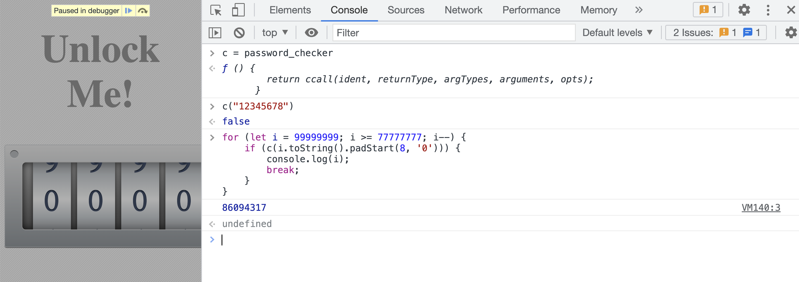
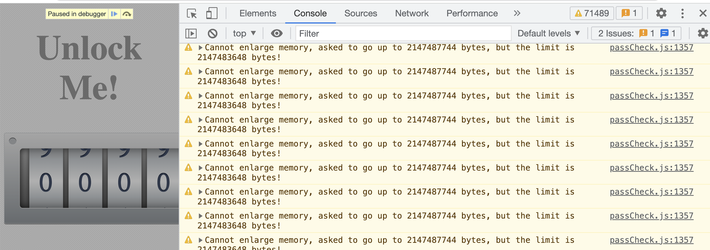
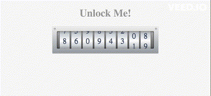

# Solution

## Setup

`passCheck.c` is compiled by Emscripten to `passCheck.js` and `passCheck.wasm`. Online implementation of base64 and xxtea in C are also used. 

Command: `emcc base64.c xxtea.c passCheck.c -o passCheck.js -s EXPORTED_FUNCTIONS="['_checker']" -s EXPORTED_RUNTIME_METHODS=ccall,cwrap -s EXPORT_ES6=1 -s MODULARIZE=1 -s ALLOW_MEMORY_GROWTH=1`.

## Analysis

As we can see from source code, we need to rotate the number locks to the correct position to unlock the locker. `checker` functions is what we need to understand.

```js
const password_checker = mod.cwrap('checker', 'boolean', ['string']);
```

The checker is referencing an extremely long WASM file. Good news is, we don't really need to reverse it! And it will probably take a long time to do so. As challenge description goes, we need at most `10^8 - 1` tries to break it - by brute forcing each digit.

First, we set a breakpoint after the `password_checker` line, at `if (password_checker(comboArray.join(""), comboArray.length)) {`.

Then, when debugger stops at the breakpoint, we can call `password_checker` function with all possible combinations. Remember to pad the number with leading zeros to make it 8 digits long.

```js
c = password_checker
for (let i = 99999999; i >= 77777777; i--) {
    if (c(i.toString().padStart(8, '0'))) {
        console.log(i);
        break;
    }
}
```



Note that the loop cannot be too large (e.g. loop from 0 to 10^8) because it will trigger Emscripten memory limit exceeding alert. 

```
passCheck.js:1357 Cannot enlarge memory, asked to go up to 2147487744 bytes, but the limit is 2147483648 bytes!
```

Well, spending 2GB on browser memory is indeed a lot I guess. Splitting it into segments will work fine.



Now that if we rotate the locker to this number, we can see a "FLAGGED" message. The flag is thus `cvctf{86094317}`.

