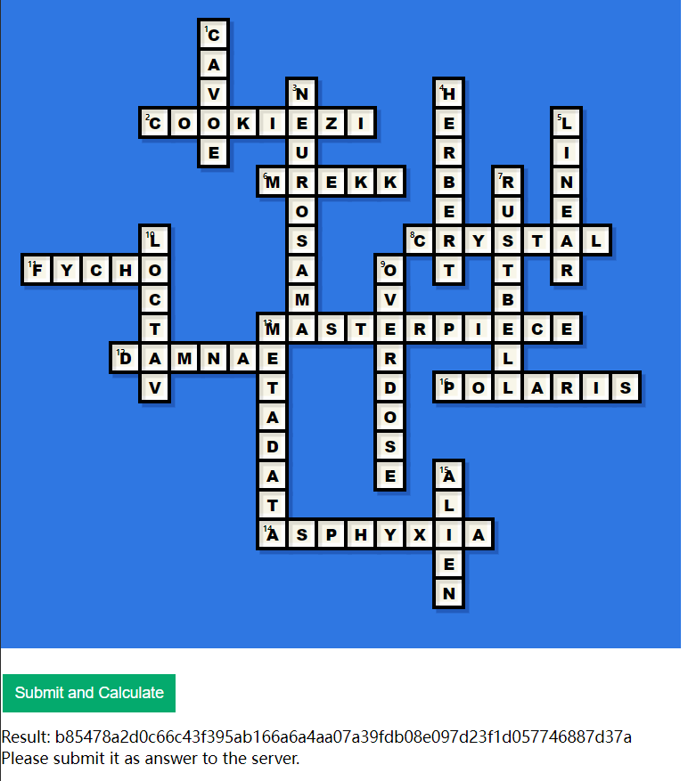

# osu-crossword

Come solve my osu!crossword challenge. Once you completed the puzzle and obtained the hash, submit it to remote server for verification.

Note: All characters should be in lowercase.

https://osu-ctf-crossword-8a7bcd.surge.sh/

`nc chal.osugaming.lol 7270`

## Solution

Hash: `b85478a2d0c66c43f395ab166a6a4aa07a39fdb08e097d23f1d057746887d37a`