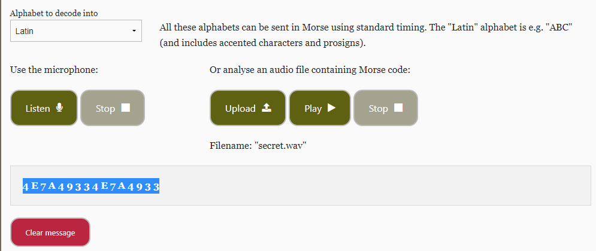
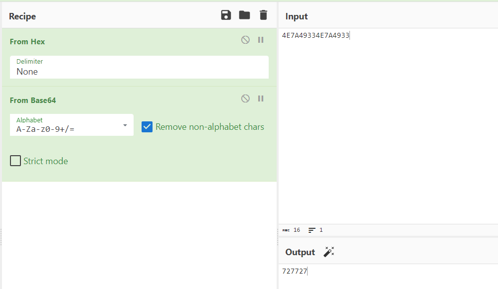
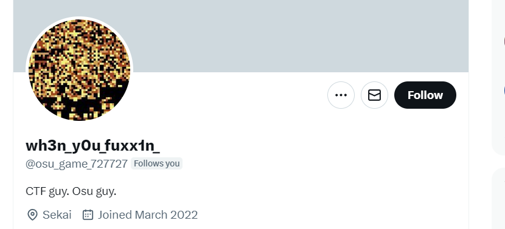
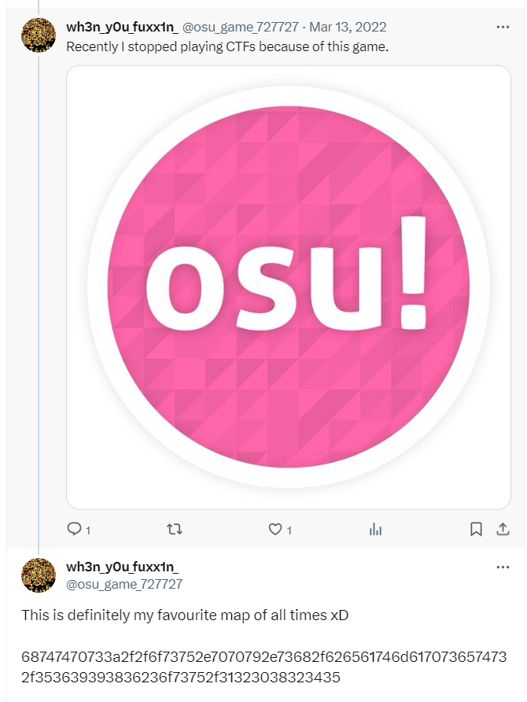
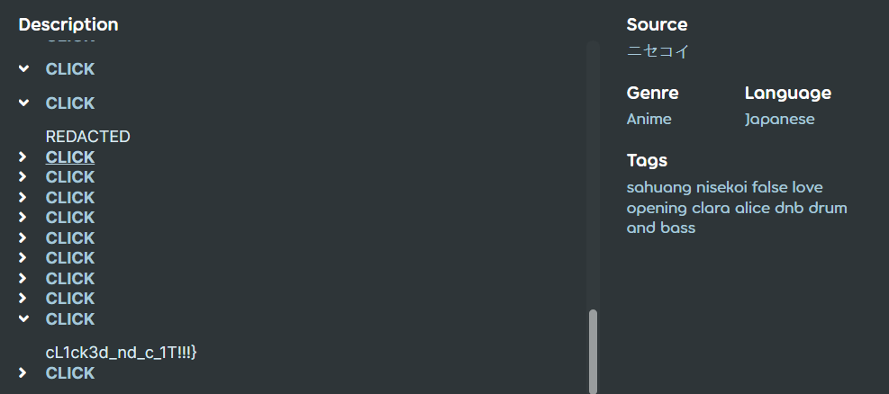

# when-you-see-it

My friend is recently so obsessed with osu! that he refused to play any CTFs! Today he came to me and sent me this weird GIF, can you understand what he is trying to tell me?

Hint: He told me this is important: "Who is the player in the meme?"

https://drive.google.com/file/d/1uKFu2542p3v-1nl5yPz2oYyL5zugREVG/view?usp=sharing

## Solution

1. We binwalk the gif and noticed it consists of a gif and a zip file. We extract the zip file and find out that it is password protected. As the hint mentioned, we found the "727 wysi" meme reference on [YouTube](https://www.youtube.com/watch?v=AaAF51Gwbxo) which shows the player in the meme is *Aireu*. This is also the password to the zip file. (One can definitely crack it as it's only 5 characters).

2. Upon opening the zip we see 2 files, `confidential` and `secret.wav`.

```
HIGHLY CONFIDENTIAL

<REDACTED>
I have stored extremely important files here and in another place.

Find it at "osu_game_/[0-9]+/".

As a reward, here is the first part of the flag: `osu{@nd_`

Yours,

Team Osu!Gaming
</REDACTED>
```

3. The `secret.wav` file appears to be a morse code. We can decode it from any online website like [Morse Decoder](https://morsecode.world/international/decoder/audio-decoder-adaptive.html), which plays to `4E7A49334E7A4933`:



Decode it twice in CyberChef and we got `727727`.



4. Now we have a handle `osu_game_727727`, and the `at` suggests we can go to social medias like Twitter to find the user. Indeed, we find this player on Twitter: https://twitter.com/osu_game_727727



This also gives the 2nd part of the flag. Now we have `osu{@nd_wh3n_y0u_fuxx1n_`.

5. Checking the Tweets, first tweet decodes to rickroll, but another Tweet comes into sight:



Decode it, we get osu! beatmap https://osu.ppy.sh/beatmapsets/569986#osu/1208245.

6. The last part is simple - open all the "CLICK" spoilers, one of them has the actual part 3 flag:



And we have our final flag: `osu{@nd_wh3n_y0u_fuxx1n_cL1ck3d_nd_c_1T!!!}`.