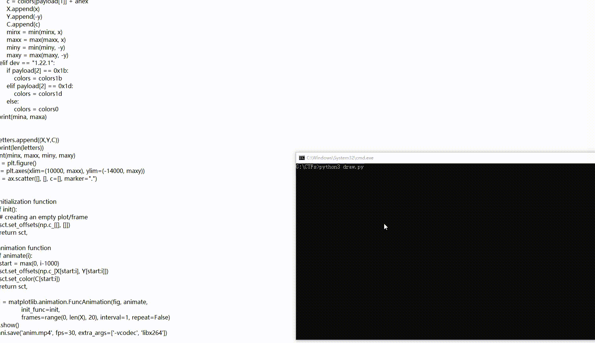

# Let's Play osu!

## Solution

We are provided with a USB capture of the osu! game. We need to find the message that was drawn on the beatmap.

### Understand gameplay

osu! is a rhythm game. The player is given a beatmap, and has to hit the notes/sliders in the map. Devices include keyboard, mouse, and tablet.

On keyboard, usually `z` and `c` are used to click the circles and `c` is used for "smoking". Tablet is used for cursor movements. You can learn more about game rules at [osu! wiki](https://osu.ppy.sh/wiki/osu!_Wiki).

### Parsing pcap

Reading the pcap we know the player is using keyboard and tablet. We can dump useful information from the pcap by the following command.

`tshark -r osu.pcap -Y 'usbhid.data' -T fields -e usb.src -e usbhid.data`

Its data look like this:

```
1.59.1	0880573be021000000000000
1.59.1	08805a3bdc21000000000000
1.59.1	08805d3bd821000000000000
...
1.22.1	00001d0000000000
1.59.1	088074449b15000000000000
1.59.1	088071449815000000000000
...
1.22.1	0000000000000000
1.59.1	08807a45d82d000000000000
...
```

As we are drawing something on tablet, data in `1.59.1` is likely the current drawing state, and `1.22.1` is what separates different drawings. If we read some online tablet specs, we can know what the hex means.

```
08  80   57  3b   e0  21   000000000000
(dummy) (x axis) (y axis)   (pressure)
```

### Drawing message

Now you can use python to draw the message.

```py
import matplotlib
import matplotlib.pyplot as plt
from matplotlib.animation import FuncAnimation
from itertools import groupby
import numpy as np

path = "osu.txt" # the dump data
ds = [i.split("\t") for i in open(path).read().splitlines()]
data = [(i, bytes.fromhex(j)) for i, j in ds]

mode = 0
modes = sorted(set(i[1] for i in data if i[0] == "1.22.1"))
colors0 = {
    198: "#B71C1C",
    129: "#E0E0E0",
    128: "#33691E",
}
colors1d = {
    198: "#B71C1C",
    129: "#B71C1C",
    128: "#00838F",
}
colors1b = {
    198: "#B71C1C",
    129: "#D84315",
    128: "#37474F",
}
colors = colors0

x = y = 0
letters = []

minx = float("inf")
maxx = float("-inf")
miny = float("inf")
maxy = float("-inf")
# mina = float("inf")
# maxa = float("-inf")

X = []
Y = []
C = []

for dev, payload in data:
    if dev == "1.59.1":
        x = payload[2] + payload[3] * 256
        y = payload[4] + payload[5] * 256
        a = payload[6] + payload[7] * 256
        # mina = min(mina, a)
        # maxa = max(maxa, a)
        a = int(a / 5292 * 255)
        ahex = hex(a)[2:].zfill(2)
        if a == 0: ahex = "06"
        c = colors[payload[1]] + ahex
        X.append(x)
        Y.append(-y)
        C.append(c)
        minx = min(minx, x)
        maxx = max(maxx, x)
        miny = min(miny, -y)
        maxy = max(maxy, -y)
    elif dev == "1.22.1":
        if payload[2] == 0x1b:
            colors = colors1b
        elif payload[2] == 0x1d:
            colors = colors1d
        else:
            colors = colors0
# print(mina, maxa)


# letters.append((X,Y,C))
# print(len(letters))
print(minx, maxx, miny, maxy)
fig = plt.figure() 
ax = plt.axes(xlim=(10000, maxx), ylim=(-14000, maxy)) 
sct = ax.scatter([], [], c=[], marker=".") 


# initialization function 
def init(): 
    # creating an empty plot/frame 
    sct.set_offsets(np.c_[[], []])
    return sct, 

# animation function 
def animate(i): 
    start = max(0, i-1000)
    sct.set_offsets(np.c_[X[start:i], Y[start:i]])
    sct.set_color(C[start:i])
    return sct, 

ani = matplotlib.animation.FuncAnimation(fig, animate, 
                init_func=init,
                frames=range(0, len(X), 20), interval=1, repeat=False) 
plt.show()
```

There are some tiny coloring issues due to pressure settings, but we can clearly read the flag from the plot. `vsctf{OSU_IS_SUPER_LAGGY_W_SLIDERS}`

