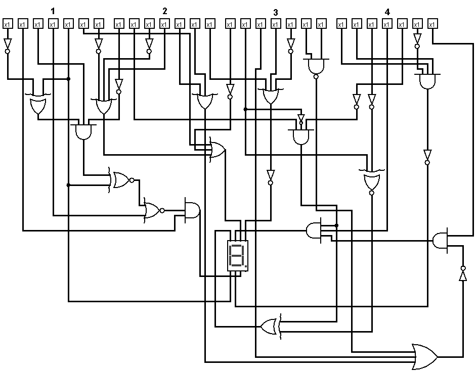
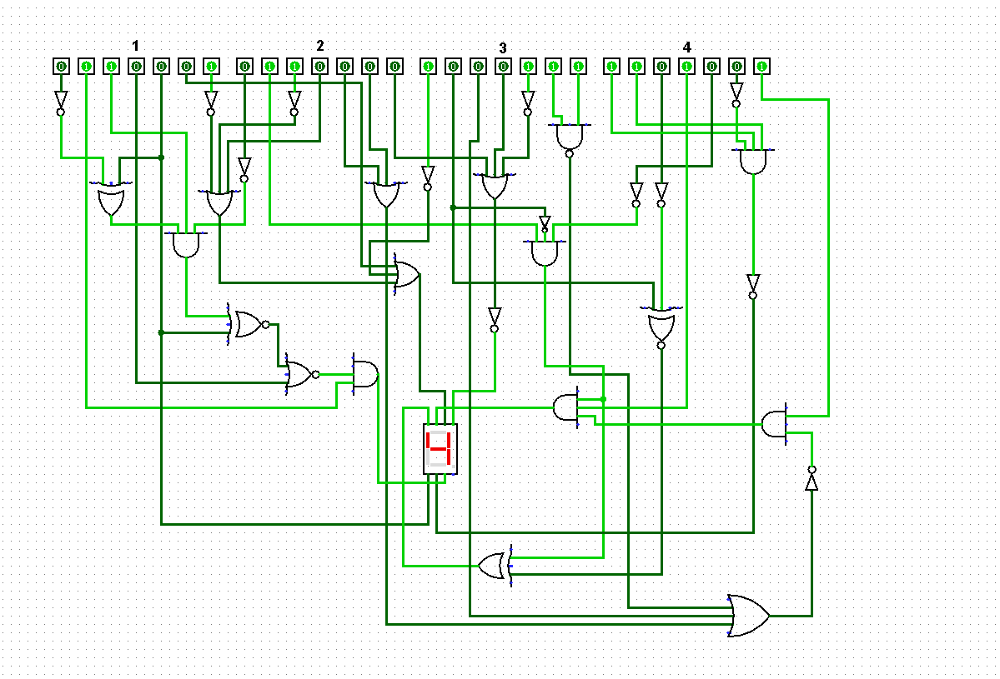

# Lost Assignment

## Solution

- Searching for keywords in the xml, we can see it is a circ file and can be loaded by `logisim`
- Load in `logisim` and solve the gates
- Obtain the binary numbers, convert to 4 ASCIIs and then characters
- Flag is `vsctf{10Gi}`

