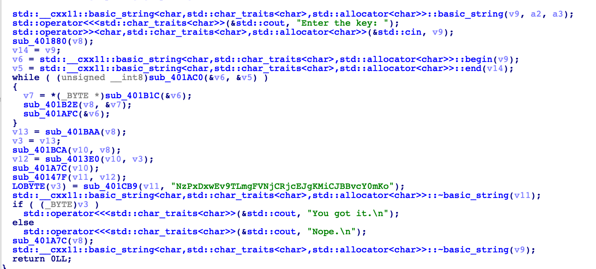

# Writeup

## Overview

In this challenge we are given a zip folder with 1337 binary files. Our goal is to reverse all the files and find the secret. It is (almost) unrealistic to manually reverse each binary by hand, fortunately we can observe that all binaries follow a similar structure, allowing us to reverse them programically.

The idea is inspired by a challenge in *2018-CFI-CTF*.

## Detail

### Analyze Binary

Let's take `file_0` as an example. When we run it, we are asked to input a key and will get "Nope" if key is incorrect. 

If we drop the elf file to IDA we can see the following decompiled code:



Starting from the bottom, our input key would be correct only if `sub_401CB9(v11, "NzPxDxwEv9TLmgFVNjCRjcEJgKMiCJBBvcY0mKo")` returns true - and since `sub_401CB9` is essentially doing a string comparison we want `v11` to equal that hard-coded string.

The key function here is `sub_40147F(v11, v12)`. Below is the decompiled code.

```cpp
__int64 __fastcall sub_40147F(__int64 a1, char *a2)
{
  char v3; // [rsp+1Fh] [rbp-51h] BYREF
  char v4[32]; // [rsp+20h] [rbp-50h] BYREF
  char v5[40]; // [rsp+40h] [rbp-30h] BYREF

  std::allocator<char>::allocator(&v3);
  std::__cxx11::basic_string<char,std::char_traits<char>,std::allocator<char>>::basic_string(a1, &unk_40400A, &v3);
  std::allocator<char>::~allocator(&v3);
  if ( a2 )
  {
    sub_40147F(v4, *((_QWORD *)a2 + 1));
    std::__cxx11::basic_string<char,std::char_traits<char>,std::allocator<char>>::operator+=(a1, v4);
    std::__cxx11::basic_string<char,std::char_traits<char>,std::allocator<char>>::~basic_string(v4);
    std::__cxx11::basic_string<char,std::char_traits<char>,std::allocator<char>>::operator+=(a1, (unsigned int)*a2);
    sub_40147F(v5, *((_QWORD *)a2 + 2));
    std::__cxx11::basic_string<char,std::char_traits<char>,std::allocator<char>>::operator+=(a1, v5);
    std::__cxx11::basic_string<char,std::char_traits<char>,std::allocator<char>>::~basic_string(v5);
  }
  return a1;
}
```

Note a few things here:

1. `sub_40147F` is called twice in itself - one on `*((_QWORD *)a2 + 1))` and one on `*((_QWORD *)a2 + 2))`. At this stage we do not really know what `a2` is, but since we have `if(a2)` it is likely a pointer and we call it recursively.

2. Inside the if bracket, we first append to `a1` string `v4`, then value at `a2`, and finally string `v5`, where `v4` and `v5` are results of the recursion function. 

Does this look familiar? In the challenge we are hinted that the secret is hiding behind the **trees** - It immediately comes to mind that the function is likely returning the string result of a tree with in-order traversal (recursively print root->left, then root, then root->right).

To verify our guess, let's check what's `v12 = sub_4013E0(v10, v3)` in the original program. From the decompiled code, we can see that our input string will be stored in a char array `v10`, and `v3` is the size of input string (which should be the same as that hard-coded string). 

```cpp
__int64 __fastcall sub_4013E0(__int64 a1, int a2)
{
  char *v2; // rax
  __int64 v3; // rbx
  char v5[84]; // [rsp+10h] [rbp-70h] BYREF
  int i; // [rsp+64h] [rbp-1Ch]
  __int64 v7; // [rsp+68h] [rbp-18h]

  v7 = 0LL;
  sub_401914(v5);
  for ( i = 0; i < a2; ++i )
  {
    v2 = (char *)sub_4019EE(a1, i);
    v7 = sub_401339(v7, (unsigned int)*v2, v5);
  }
  v3 = v7;
  sub_40182C(v5);
  return v3;
}
```

The for-loop iterates all characters in the array and `v2` is the current character. Further analyzing `sub_401339`, we see that it is essentially inserting this `v2` in the tree rooted `v7`. Below is the commented decompiled code.

```cpp
__int64 __fastcall sub_401339(__int64 a1, char a2, __int64 a3)
{
  __int64 v5;
  __int64 v6;

  v5 = a1;
  v6 = sub_4012F6((unsigned int)a2);
  if ( a1 )
  {
    if ( *(_QWORD *)(*(_QWORD *)sub_40189C(a3) + 8LL) )
    {
	  // If ROOT's left is non-empty, insert to right
      *(_QWORD *)(*(_QWORD *)sub_40189C(a3) + 16LL) = v6;
      sub_4018B6(a3);
    }
    else
    {
	  // Insert to left if left is empty
      *(_QWORD *)(*(_QWORD *)sub_40189C(a3) + 8LL) = v6;
    }
  }
  else
  {
	// Root is empty - take this slot
    v5 = v6;
  }
  sub_4018D2(a3, &v6);
  return v5;
}
```

At this point, almost everything is clear in this binary:

1. Input string is inserted to a binary tree in sequential order, character by character.

2. The output is the in-order traversal of this tree.

3. Output is compared with a hard-coded string.

### Find mapping

Now we can simply reverse this binary. Note that all binaries have different hard-coded strings but they all have the same length of 39. Therefore, the easiest way is to write a program that achieves in-order traversal, and we can note down input at position `i` is mapped to output position `j` to get a map. This map can then be reversed to find input given the output.

You can refer to [gen.cpp](/Binary/Binary%20Flood/gen.cpp) for reference.

This gives us output to input mapping.

### Automate binary processing

The next step is to automate binary processing. Essentially we want to retrieve that hard-coded string in binaries - that's all we need. `objdump` will be a nice tool for it.

```bash
% objdump -s -j .rodata file_0

file_0:	file format ELF64-x86-64

Contents of section .rodata:
 404000 01000200 00000000 00000045 6e746572  ...........Enter
 404010 20746865 206b6579 3a200000 00000000   the key: ......
 404020 4e7a5078 44787745 7639544c 6d674656  NzPxDxwEv9TLmgFV
 404030 4e6a4352 6a63454a 674b4d69 434a4242  NjCRjcEJgKMiCJBB
 404040 76635930 6d4b6f00 596f7520 676f7420  vcY0mKo.You got 
 404050 69742e0a 004e6f70 652e0a00 76656374  it...Nope...vect
 404060 6f723a3a 5f4d5f72 65616c6c 6f635f69  or::_M_realloc_i
 404070 6e736572 74000000 63616e6e 6f742063  nsert...cannot c
 404080 72656174 65207374 643a3a64 65717565  reate std::deque
 404090 206c6172 67657220 7468616e 206d6178   larger than max
 4040a0 5f73697a 65282900                    _size().
```

There might be other ways of extracting elf string but this one works fine, since all binaries follow exactly the same format.

We write the following script to obtain all strings in binaries and concat them in order.

```py
import os

input  = "abcdefghijklmnopqrstuvwxyzABCDEFGHIJKLM"
output = "FpGhHqIdJrKiLsMbtjuevkwaxlyfzmAcBnCgDoE"

out_to_in_map = {}
for i in range(len(output)):
	c = output[i]
	out_to_in_map[i] = input.find(c)

res = ""

# We know string is from 237, 299, 361 for file_0
# But for file_10 for example, it needs to start from 238 because
# objdump prints the file name!
for i in range(1337):
	tmp = os.popen(f"objdump -s -j .rodata file_{i}").read()
	extra = len(str(i)) - 1
	tmp = tmp[237+extra:253+extra] + tmp[299+extra:315+extra] + tmp[361+extra:368+extra]
	cur = [None] * 39
	for i in range(len(tmp)):
		cur[out_to_in_map[i]] = tmp[i]
	res += "".join(j for j in cur)
print(res)
```

Final output is a very long string. We remove its trailing 0's and notice it's a base64 string. Now we can convert base64 to some binary data and PDF format.

```py
last = len(res)-1
while res[last] == '0':
	last -= 1
res = res[:last+1]
while len(res) % 4 != 0:
	res += '='

import base64
bn = base64.b64decode(res)
with open("result.pdf", "wb") as f:
	f.write(bn)
```

We can find the flag in `result.pdf`.

Flag: `vsctf{templated_binaries_are_1337}`