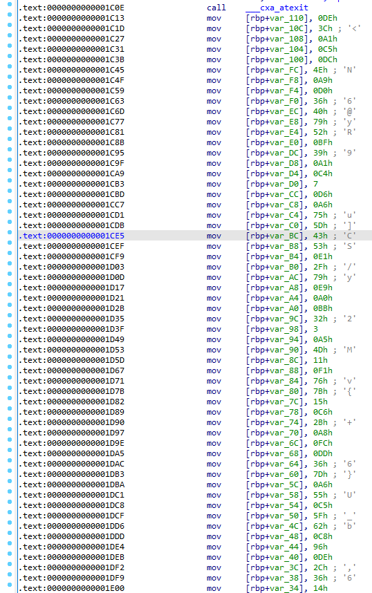

# Writeup

We are given an ELF binary.

```text
sahuang@DESKTOP:~/functional_cpp$ file challenge
challenge: ELF 64-bit LSB shared object, x86-64, version 1 (SYSV), dynamically linked, interpreter /lib64/ld-linux-x86-64.so.2, BuildID[sha1]=314a10955b0e374d661e2d60d6ee02f13545c4c4, for GNU/Linux 3.2.0, not stripped
sahuang@DESKTOP:~/functional_cpp$ ./challenge
Your flag is either at https://www.youtube.com/watch?v=dQw4w9WgXcQ, or here: test
Sorry not here.
sahuang@DESKTOP:~/functional_cpp$ ./challenge
Your flag is either at https://www.youtube.com/watch?v=dQw4w9WgXcQ, or here: vsctf{ssssssss}
Sorry not here.
```

Challenge file is not stripped and is intended to be an easy to medium challenge about functional programming in C++. Opening in IDA and decompile, we can analyze the binary by parts.

## Part 1

```cpp
v41 = __readfsqword(0x28u);
std::allocator<int>::allocator(v38, argv, envp);
v39[0] = 0;
std::vector<int>::vector(v37, 61LL, v39, v38);
std::allocator<int>::~allocator(v38);
srand(12345LL);
for ( i = 0; i <= 0x10000; ++i )
    v36 = (int)rand() % 256;
for ( j = 0; j <= 2; ++j )
{
    v3 = rand();
    *(_DWORD *)std::vector<int>::operator[](v37, j) = v3 % 256;
}
std::__cxx11::basic_string<char,std::char_traits<char>,std::allocator<char>>::basic_string(v40);
std::operator<<<std::char_traits<char>>(
&std::cout,
"Your flag is either at https://www.youtube.com/watch?v=dQw4w9WgXcQ, or here: ");
v4 = v40;
std::operator>><char>(&std::cin, v40);
```

We noticed `srand(12345LL)` which seems like the `random` module of C++. However, if you zoom in, it is actually a customized implementation (though not 100% custom because official C random uses it). 

```cpp
__int64 __fastcall srand(unsigned int a1)
{
    __int64 result; // rax

    result = a1;
    next_int = a1;
    return result;
}
```

Essentially `next_int` is initialized to 12345. The next part can be decompiled to

```cpp
for (auto i = 0; i < 65537; ++i) {
    auto tmp = rand() % 256;
}
for (auto i = 0; i < 3; ++i) {
    v37[i] = rand() % 256;
}
```

And the `rand()` is defined as

```cpp
unsigned __int64 rand()
{
    next_int = 1103515245 * next_int + 12345;
    return ((unsigned __int64)next_int >> 16) & 0x7FFF;
}
```

Note that overflow here is possible and expected since `next_int` is an unsigned int, so `next_int = 1103515245 * next_int + 12345` will not be overly large. Here we can use C++ to reproduce it.

```cpp
#include <iostream>

using namespace std;
static unsigned long int next_int = 0;

int rand(void) {
    next_int = next_int * 1103515245 + 12345;
    return (unsigned int)(next_int/65536) % 32768;
}

void srand(unsigned int seed)
{
    next_int = seed;
}

int main() {
    srand(12345);
    for (auto i = 0; i < 65537; ++i) {
        auto tmp = rand() % 256;
    }
    for (auto i = 0; i < 3; ++i) {
        cout << rand() % 256 << endl;
    }
    return 0;
}
```

Output is 19, 200, 209. Next we read in the flag string and store it in `v40`. The flag is of length 58.

## Part 2

```cpp
for ( k = 3; ; ++k )
{
    v6 = k;
    if ( v6 >= std::vector<int>::size(v37) )
        break;
    v30 = 0;
    LOBYTE(v31) = main::{lambda(char)#2}::operator()((__int64)&v27, 0);
    v8 = (_DWORD *)std::vector<int>::operator[](v37, k - 3);
    v9 = main::{lambda(char)#2}::operator() const(char)::{lambda(char)#1}::operator()((char *)&v31, *v8);
    v38[0] = main::{lambda(char)#2}::operator()((__int64)&v27, v9);
    v10 = (_DWORD *)std::vector<int>::operator[](v37, k - 2);
    v11 = main::{lambda(char)#2}::operator() const(char)::{lambda(char)#1::operator()(v38, *v10);
    LOBYTE(v39[0]) = main::{lambda(char)#2}::operator()((__int64)&v27, v11;
    v12 = (_DWORD *)std::vector<int>::operator[](v37, k - 1);
    v30 = main::{lambda(char)#2}::operator() const(char)::{lambda(char)#1}::operator()((char *)v39, *v12);
    LOBYTE(v39[0]) = main::{lambda(char)#3}::operator()((__int64)&v28, v30);
    v30 = main::{lambda(char)#3}::operator() const(char)::{lambda(int)#1}::operator()((char *)v39, 256);
    v4 = (char *)k;
    v13 = (_DWORD *)std::vector<int>::operator[](v37, k);
    *v13 = v30;
}
```

This is where functional programming is introduced - we have lambda expressions and we need to figure out what they do. Binary is unstripped to help you better understand their meaning. For example, if we zoom in `lambda(char)#1` by double clicking its `::operator()`, we can see the following:

```cpp
__int64 __fastcall main::{lambda(char)#2}::operator() const(char)::{lambda(char)#1}::operator()(char *a1, char a2)
{
    return (unsigned int)(*a1 + a2);
}
```

So essentially it is returning the sum of two numbers. In fact, we can write this in C++

```cpp
auto c_addition = [](char a) -> auto {
    return[a](char b) -> auto {
        return (char)a + b;
    };
};
```

And use `c_addition(x)(y)` to calculate `x+y`.

Here before `LOBYTE(v39[0]) = main::{lambda(char)#3}::operator()((__int64)&v28, v30);`, we calculated `v37[k-3] + v37[k-2] + v37[k-1]`. This sum is then passed to another lambda modding 256, then store in `v37[k]`.

With this we can recover the original `v37`.

```py
v37 = [19, 200, 209]

for k in range(3, 61):
    tmp = v37[k-3] + v37[k-2] + v37[k-1]
    tmp %= 256
    v37.append(tmp)

print(v37)

'''
[19, 200, 209, 172, 69, 194, 179, 186, 47, 156, 133, 80, 113, 70, 7, 190, 11, 208, 153, 116, 221, 234, 59, 2, 39, 100, 141, 24, 9, 174, 207, 134, 3, 88, 225, 60, 117, 146, 67, 74, 31, 172, 21, 224, 161, 150, 23, 78, 251, 96, 169, 4, 13, 186, 203, 146, 23, 116, 29, 168, 57]
'''
```

## Part 3

```cpp
std::allocator<int>::allocator(&v31, v4, v7);
v39[0] = 0;
std::vector<int>::vector(v38, 61LL, v39, &v31);
std::allocator<int>::~allocator(&v31);
std::allocator<int>::allocator(&v29, 61LL, v14);
v31 = 0;
std::vector<int>::vector(v39, 61LL, &v31, &v29);
std::allocator<int>::~allocator(&v29);
v15 = std::vector<int>::begin(v38);
v16 = std::vector<int>::end(v37);
v17 = std::vector<int>::begin(v37);
std::transform<__gnu_cxx::__normal_iterator<int *,std::vector<int>>,__gnu_cxx::__normal_iterator<int *,std::vector<int>>,main::{lambda(int)#4}>(
    v17,
    v16,
    v15);
v18 = std::vector<int>::begin(v39);
v19 = std::vector<int>::end(v38);
v20 = std::vector<int>::begin(v38);
std::transform<__gnu_cxx::__normal_iterator<int *,std::vector<int>>,__gnu_cxx::__normal_iterator<int *,std::vector<int>>,main::{lambda(int)#5}>(
    v20,
    v19,
    v18,
    (__int64)&v31);
```

Some more lambdas here, and another concept is introduced, which is transform. It is very well documented on [cppreference](https://en.cppreference.com/w/cpp/algorithm/transform) so you can take a look.

The first one, `main::{lambda(int)#4}`, shows

```cpp
__int64 __fastcall main::{lambda(int)#4}::operator()(__int64 a1, int a2)
{
    return (unsigned int)(a2 + 3);
}
```

Which is simply adding every value in `v37` by 3. Similarly, `main::{lambda(int)#5}`:

```cpp
__int64 __fastcall main::{lambda(int)#5}::operator()(_QWORD *a1, unsigned int a2)
{
    int v3; // [rsp+14h] [rbp-Ch] BYREF
    unsigned __int64 v4; // [rsp+18h] [rbp-8h]

    v4 = __readfsqword(0x28u);
    v3 = main::{lambda(int)#1}::operator()(*a1, a2);
    return main::{lambda(int)#1}::operator() const(int)::{lambda(int)#1}::operator()(&v3, 7u);
}

__int64 __fastcall main::{lambda(int)#1}::operator() const(int)::{lambda(int)#1}::operator()(_DWORD *a1, unsigned int a2)
{
    return a2 ^ *a1;
}
```

It will call `x ^ 7` for all `x` in `v37`.

```py
v37 = [i + 3 for i in v37]
v37 = [i ^ 7 for i in v37]
print(v37)

'''
[17, 204, 211, 168, 79, 194, 177, 186, 53, 152, 143, 84, 115, 78, 13, 198, 9, 212, 155, 112, 231, 234, 57, 2, 45, 96, 151, 28, 11, 182, 213, 142, 1, 92, 227, 56, 127, 146, 65, 74, 37, 168, 31, 228, 163, 158, 29, 86, 249, 100, 171, 0, 23, 186, 201, 146, 29, 112, 39, 172, 59]
'''
```

## Part 4

```cpp
for ( l = 3; ; ++l )
{
    v21 = l;
    if ( v21 >= std::vector<int>::size(v39) )
    break;
    v22 = *(char *)std::__cxx11::basic_string<char,std::char_traits<char>,std::allocator<char>>::operator[](
                    v40,
                    l - 3);
    v23 = *(_DWORD *)std::vector<int>::operator[](v39, l) ^ v22;
    if ( v23 != *(_DWORD *)std::vector<int>::operator[](&secret, l - 3) )
    {
    v24 = std::operator<<<std::char_traits<char>>(&std::cout, "Sorry not here.");
    std::ostream::operator<<(v24, &std::endl<char,std::char_traits<char>>);
    goto LABEL_18;
    }
}
v25 = std::operator<<<std::char_traits<char>>(&std::cout, "You got it.");
```

Easiest part - We take last 58 values of `v37` and xor with flag, then compare to `secret` and they need to be the same. The `secret` can either be obtained by dynamic debugging or IDA inspection.



```py
secret = [222, 60, 161, 197, 220, 78, 169, 208, 54, 64, 121, 82, 191, 57, 161, 196, 7, 214, 166, 117, 93, 67, 83, 225, 47, 121, 233, 160, 187, 50, 3, 165, 77, 17, 241, 118, 123, 21, 198, 43, 168, 252, 221, 54, 125, 166, 85, 197, 95, 98, 200, 150, 222, 44, 54, 20, 147, 70]

for i in range(len(secret)):
    print(chr(secret[i] ^ v37[i+3]), end='')
```

Result is `vsctf{1_b37_y0u_w1LL_n3v3r_u53_Func710n4L_C++_1n_ur_L1F3?}` and we can verify it is correct.