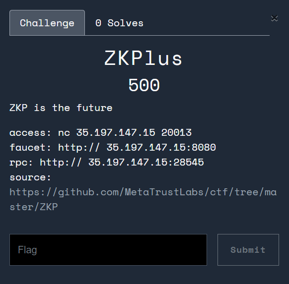

## Brief Walkthrough

### Initiatives

[MetaTrust Web3 CTF](https://ctf.metatrust.io/) was ultimate chaos and a lot of dramas happening in last moments. At last, 3 teams managed to solve all but one challenge: *ZKPlus*:



You can check challenge source [here](https://github.com/MetaTrustLabs/ctf/tree/master/ZKP). It is not really a "Zero Knowledge Proof" challenge (we will get to the challenge details later), but the numbers they gave were really big and it didn't seem viable to be solved within reasonable amount of time. After the CTF, org claimed to provide a writeup but up to this date (2 weeks after CTF finished), no writeup has been provided. Talking to a few pro web3 CTF players, none feels like it is solvable within CTF timeframe either.

With the idea I came up during CTF, I slighly modified the challenge and rushed *ZKPLite* the day before vsCTF. I made it much more friendly than the original challenge, and happy to see solve on it.

### Contract Overview

The Solidity contract has 2 parts, first part is library (or proxy):

```js
library ZKPLiteLib {
    struct Proof {
        uint256 a;
        uint256 b;
        uint256 c;
    }

    function hash(Proof memory proof) internal pure returns (bytes32) {
        return keccak256(abi.encodePacked(proof.a, proof.b, proof.c));
    }

    function verifyProof(Proof memory proof, address from, address to, uint256 amount) internal view returns (bool) {
        uint256 challenge = uint256(keccak256(abi.encodePacked(from, to, amount))) % 2**32;
        uint256 sum = proof.a + proof.b;

        uint256 hashed_sender_relation = uint256(keccak256(abi.encodePacked(msg.sender, proof.a))) % 2**32;

        return (sum == amount)
            && (challenge * proof.a % 2**128 == proof.c)
            && (proof.a * proof.b % 2**128 == proof.c)
            && (hashed_sender_relation == proof.b);
    }
}
```

Here we have a `Proof` struct with `a`, `b`, `c` fields. `hash` function is just a simple keccak256 hash of the struct. `verifyProof` is the main function that verifies the proof. (As you can see, it is normal Solidity code, and kinda unrelated with the concept of ZKP at all).

In `verifyProof`, the goal is to provide `Proof` that satisfies the conditions so it returns true. A few observations here:

- If `msg.sender` and `proof.a` are fixed, `hashed_sender_relation` is fixed too.
- `proof.b` is equal to `hashed_sender_relation`
- The equations involving `proof.c` seems hard to both satisfy
- `amount` is `proof.a + proof.b`, and `challenge` depends on it

```js
contract ZKPLite {
    using ZKPLiteLib for ZKPLiteLib.Proof;

    uint256 private constant TOKEN_SUPPLY = 133337;
    address owner;
    mapping(address => uint256) private balances;
    mapping(bytes32 => bool) private usedProofs;

    constructor()  {
        balances[msg.sender] = TOKEN_SUPPLY;
        owner = msg.sender;
    }

    function transfer(address to, uint256 amount, ZKPLiteLib.Proof memory proof) public {
        require(amount <= balances[owner], "Insufficient offer");
        require(!usedProofs[proof.hash()], "Proof already used");
        require(ZKPLiteLib.verifyProof(proof, msg.sender, to, amount), "Invalid proof");

        usedProofs[proof.hash()] = true;
        balances[owner] -= amount;
        balances[to] += amount;
    }

    function balanceOf(address account) public view returns (uint256) {
        return balances[account];
    }

    function isSolved() public view returns (bool) {
        return balances[owner] == 0;
    }
}
```

The `ZKPLite` contract is pretty straightforward: you start with 133337 tokens, each time you can submit a `Proof` to transfer some tokens to another address. The `Proof` must satisfy the conditions in `verifyProof` function, and it must not be used before. Goal is to make balance equal to 0. Of course, for each proof submitted, `proof.a + proof.b` needs to not exceed the current balance.

The only changes from `ZKPlus` to `ZKLite` is that `TOKEN_SUPPLY` is reduced to 133337 from 10000000000000000000000000, and the modulos on `keccak256` in `verifyProof` are reduced to 2^32 from 2^128.

### Solution

It's easy to think of the trivial situation of proof. Let `proof.a = 0`, `proof.c = 0`, then we need `amount = sum = proof.b`. Whatever `challenge` is doesn't matter. To find `proof.b = hashed_sender_relation`, we just need to get `msg.sender` and then we know `proof.b = keccak256(abi.encodePacked(msg.sender, 0)) % 2**32`. **As long as `msg.sender` is different, we can submit as many proofs as we want**.

Now, for above proof we get, amount transferred equals to `proof.b`, which is some random number below 2^32. This means

- We need to keep generating proofs until we get a lot of proofs below 133337 << 2^32
- We need to do a subset sum on the generated proofs such that the sum equals to 133337

With some brief calculation, we might need to generate `100/(133337/2^32)` which is around 3e6 numbers (assuming 100 numbers below 133337 is sufficient to get a subset sum which is quite likely). This isn't a big number, in fact with this method you need at least 2^46 (or more) in *ZKPlus*. Obviously Solidity is too slow and costly for calculations, and we can just use C++ to simulate the process.

To predict `msg.sender`, we know contract address generation logic below: (Reference [Salted contract creations / create2](https://docs.soliditylang.org/en/latest/control-structures.html#salted-contract-creations-create2))

```js
function getAddress(bytes memory bytecode, uint256 _salt) public view returns (address) {
    bytes32 hash = keccak256(
        abi.encodePacked(bytes1(0xff), address(this), _salt, keccak256(bytecode)));
    return address(uint160(uint(hash)));
}
```

We can pre-create attack contract and get its bytecode, then enumerate salt to generate enough addresses. This is implemented in `simulate.cpp`. After that, we can calculate subset sum easily and send the transactions.

```py
import pwn
from cheb3 import Connection
from cheb3.utils import encode_with_signature, calc_create2_address

def get_subsets(data: list, target: int):
    differences = {}
    for number in data:
        prospects = []
        for diff in differences:
            if number - diff == 0:
                new_subset = [number] + differences[diff]
                new_subset.sort()
                return new_subset
            elif number - diff < 0:
                prospects.append((number, diff))
        for prospect in prospects:
            new_diff = target - sum(differences[prospect[1]]) - prospect[0]
            differences[new_diff] = differences[prospect[1]] + [prospect[0]]
        differences[target - number] = [number]
    return []

def get_info(target):
    return svr.recvline_contains(target).split()[-1].strip().decode()

target = 133337
mod = 2**32
data = open("out.txt", "r").readline().split(",")[:-1]
data = [int(i, 16) for i in data]
data_new = [i % mod for i in data]
data_new = [i for i in data_new if i < target]

print(len(data_new))
subsets = get_subsets(data_new, target)
print(subsets)

HOST = "172.86.96.174"
PORT = 1337

svr = pwn.remote(HOST, PORT)
svr.sendlineafter(b"action?", b"1")
uuid = get_info(b"uuid")

conn = Connection(get_info(b"rpc"))
account = conn.account(get_info(b"private key"))
instance_addr = get_info(b"setup")
svr.close()
bytecode = "608060405234801561001057600080fd5b50610169806100206000396000f3fe608060405234801561001057600080fd5b506004361061002b5760003560e01c8063686dc35914610030575b600080fd5b61004361003e3660046100f7565b610045565b005b6040805160608101825260008082526020820184815282840191825292516361e3cec960e11b81526001600160a01b03868116600483015260248201869052925160448201529251606484015251608483015284169063c3c79d929060a401600060405180830381600087803b1580156100be57600080fd5b505af11580156100d2573d6000803e3d6000fd5b50505050505050565b80356001600160a01b03811681146100f257600080fd5b919050565b60008060006060848603121561010c57600080fd5b610115846100db565b9250610123602085016100db565b915060408401359050925092509256fea26469706673582212202ae19af0c97221b7a1f4366b769addc9862742c2788ff6235adc2cba5ce8c6df64736f6c634300080d0033"
create2deployer = "0x4e59b44847b379578588920cA78FbF26c0B4956C"

# get the salt which corresponds to this subset number
subsets_cpy = subsets.copy()
for i in range(len(data_new)):
    if data_new[i] in subsets_cpy:
        for idx in range(len(data)):
            if data[idx] % mod == data_new[i]:
                print(f"salt: {idx}, subset_num: {data_new[i]}")
                account.send_transaction(create2deployer, data=f'{idx:064x}{bytecode}', gas_price=0)
                target = calc_create2_address(create2deployer, idx, bytes.fromhex(bytecode))
                account.send_transaction(target, data=encode_with_signature("callTransfer(address,address,uint256)", instance_addr, target, data_new[i]), gas_price=0)
                subsets_cpy.remove(data_new[i])
                break

svr = pwn.remote(HOST, PORT)
svr.sendlineafter(b"action?", b"3")
svr.sendlineafter(b"uuid please: ", uuid.encode())
svr.interactive()
```